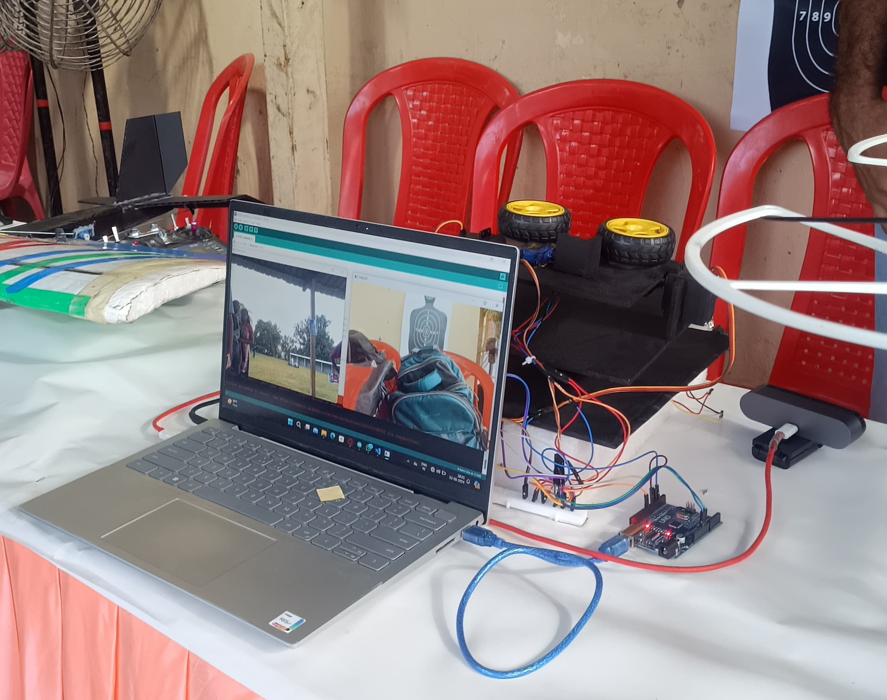
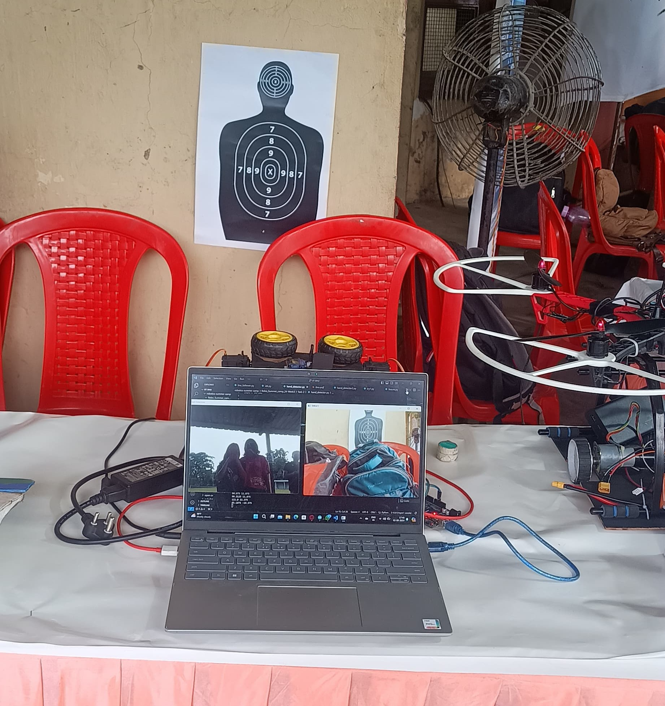

# Live-Coordinate-Gesture-Shooter (LCGS)
## Overview

This project showcases a gesture-controlled bot that interprets hand gestures to execute directional movements and perform shooting actions. The bot uses a vision-based system to detect hand gestures and sends corresponding commands to an Arduino to control multiple servos for precise movements.

Here are a few images of the bot:




## Demonstration Video
https://github.com/user-attachments/assets/33ced09a-d48a-46dd-97fc-79f2347ae8e2


## Features
- **Hand Gesture Detection:** The system uses OpenCV and MediaPipe to recognize hand gestures in real-time.
- **Servo-Controlled Movements:** Four servos enable horizontal, vertical, and shooting motions based on gesture inputs.
- **Real-Time Serial Communication:** The bot receives commands through serial communication and responds immediately to hand gesture inputs.
- **Gesture-Based Shooting:** The bot moves and shoots based on recognized gestures, allowing interactive control.

## Components
- **Python Script:** Uses OpenCV and MediaPipe for hand gesture recognition. It detects whether all fingers are open or if the index finger is raised and sends corresponding data to the Arduino.
- **Arduino Script:** Controls four servos for bot movements based on serial input received from the Python script.

## Setup

### Hardware Requirements
- Arduino board
- 4 Servo motors
- A mechanism for shooting
- USB cable for Arduino-PC connection
- Computer with Python installed

### Software Requirements
- [Python 3.x](https://www.python.org/)
- [OpenCV](https://opencv.org/) for image processing
- [MediaPipe](https://google.github.io/mediapipe/) for hand tracking
- Arduino IDE for uploading the servo control script

## Installation

1. **Clone the Repository:**
   ```bash
   git clone <repository-link>
   cd <repository-directory>
2. **Install Python Dependencies**
   ```bash
   pip install opencv-python mediapipe
3. **Upload the Arduino Script:**
- Open the Arduino IDE.
- Load the servo_control.ino script located in the Arduino folder.
- Upload it to the Arduino board.
4. **Run the Python Script**
- Connect your camera and arduino.
- Run the python script
  ```bash
  python hand_gesture_control.py
  
 ## How It Works

- The bot's camera detects hand gestures using the MediaPipe and OpenCV library.
- It identifies if all fingers are open or if the index finger is raised.
- Based on the detected gestures, directional commands are sent to the Arduino via serial communication.
- The Arduino receives the angles and adjusts the servos accordingly, moving the bot and initiating the shooting mechanism.

## Usage

### Start the Bot:
1. Point the camera toward your hand.
2. Raise the index finger to see a cross mark on the finger tip to aim. Move your hand around in this position to change the target position.
3. Open all your fingers to shoot once you have finished aiming.
